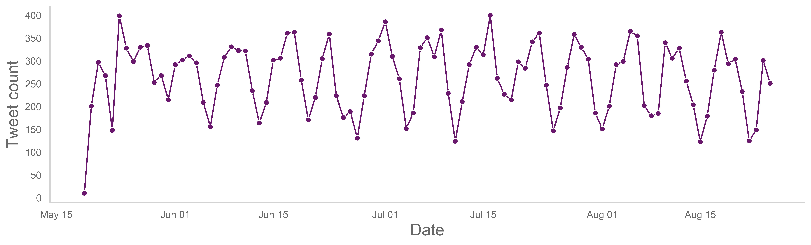
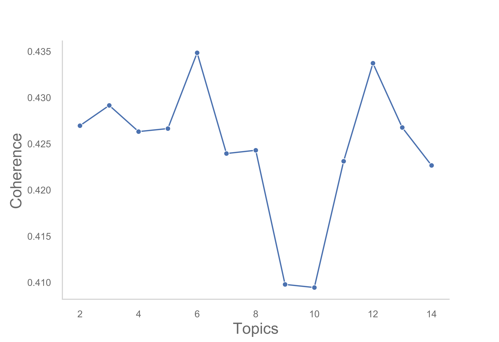
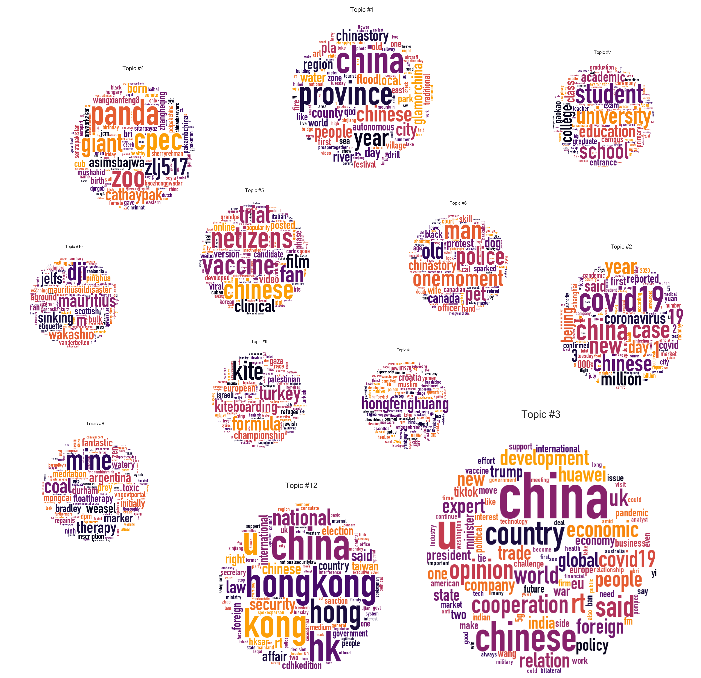
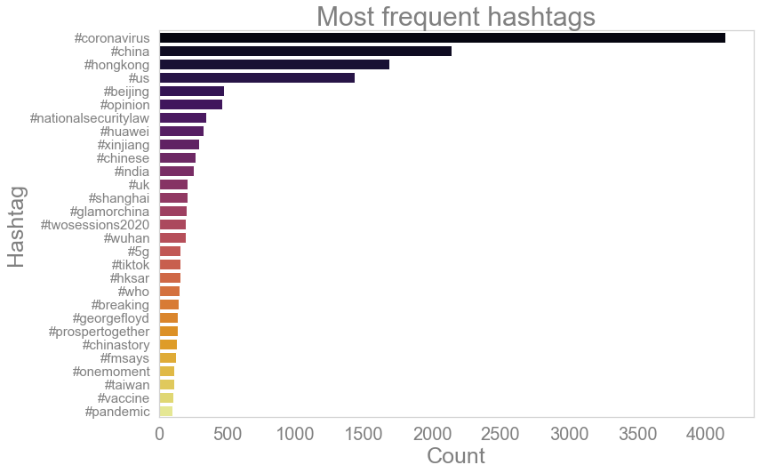
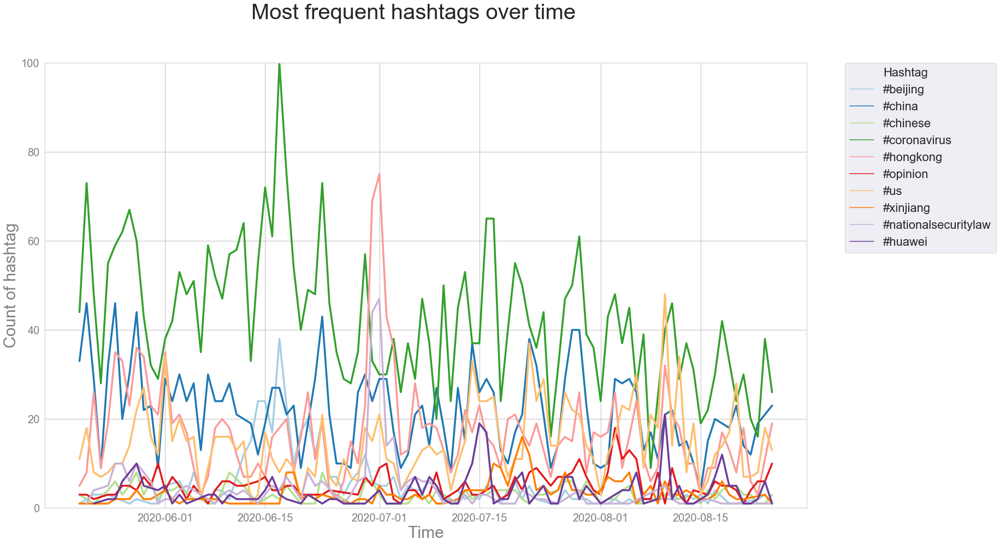
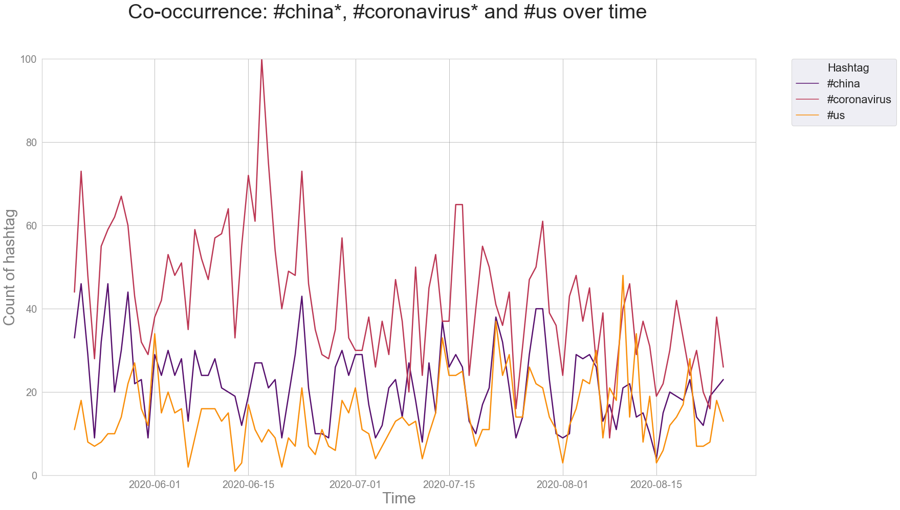
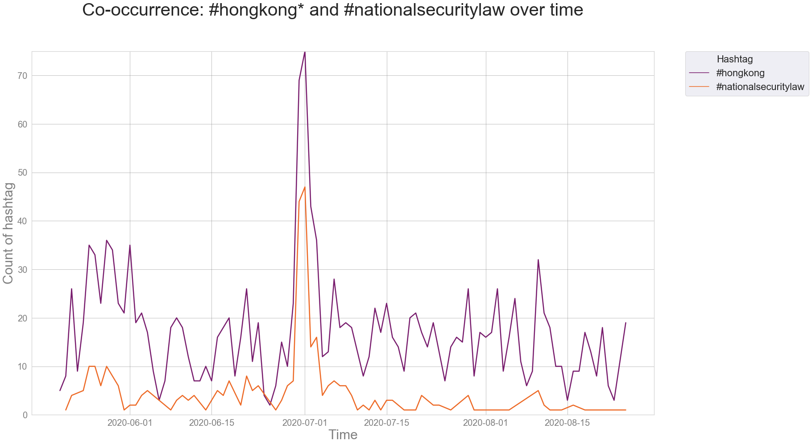
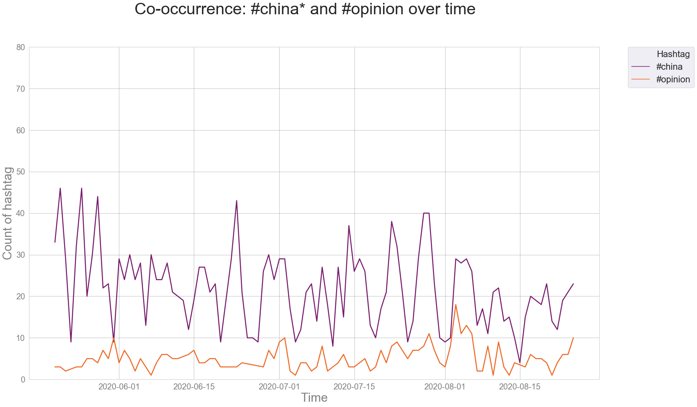
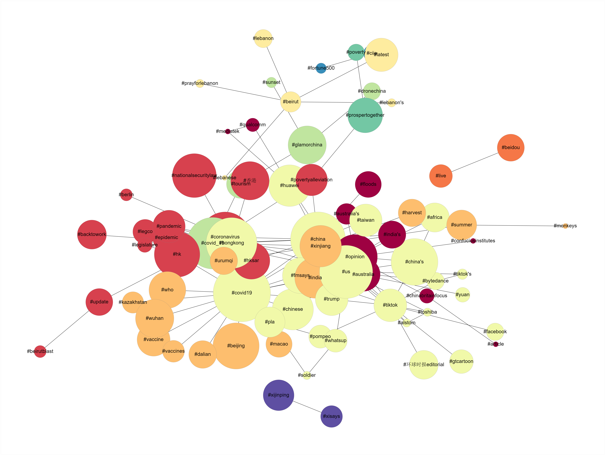
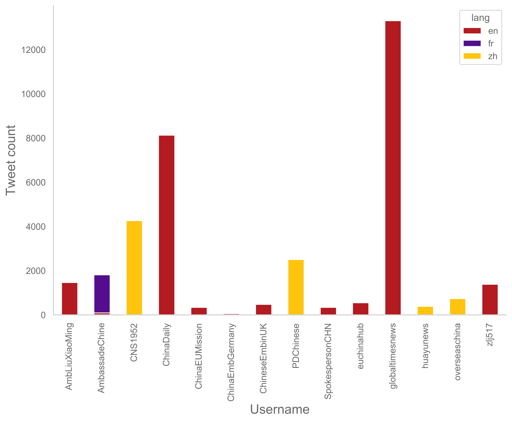

# Chinese Twitter
_by Mette Thunø_

## Project Developers
Anita Kurm and Maris Sala 

## Project description
Exploration of tweets by [Chinese officials](https://docs.google.com/document/d/1q4XxcWuYIAu-DRc45zEbbE_Ybq5-jxRz/edit#heading=h.gjdgxs) for a research application. Main goal was to develop informative visualisations described below.

## Methods

### Data description
Using a Twitter API, we have so far collected a Twitter corpus, which contains 26.165 tweets posted in English language (for other langauges see Notes) in the period from 2020-05-19 to 2020-08-25 by the following accounts: 

| Account Name | Number of *English* tweets included in the analysis | Comment |
| --- |:---:|---|
| globaltimesnews|13309||
| ChinaDaily |8128||
| AmbLiuXiaoMing | 1465||
| zlj517|1386||
| euchinahub|550||
| ChineseEmbinUK|477||
| SpokespersonCHN|342||
| ChinaEUMission|340||
| AmbassadeChine |94|we have collected more data, but most tweets by the account are in French|
| ChinaEmbGermany|56||
| overseaschina|10|we have collected more data, but most tweets by the account are in Chinese|
| PDChinese|8|we have collected more data, but most tweets by the account are in Chinese|
| huayunews|0|we have collected data, but the account tweets only in Chinese|
| CNS1952|0|we have collected data, but the account tweets only in Chinese|
| mfa_china|0|**data collection started on 26-08** (there was a problem with a scraper before)|
| chinaembassyusa|0|**data collection started on 26-08** (there was a problem with a scraper before)|
| ChinoisEnFrance|0| the account hasn't posted since May 2012|
| ouzhounews|0|does not exist|

The following plot shows the count of English tweets added to the corpus depending on the date:

### Data pre-processing 
The preprocessing was conducted using the [NLTK](https://www.nltk.org) library and the [Text to X](https://github.com/centre-for-humanities-computing/text_to_x) pipeline in Python 3.6.

All tweets in the corpus have been lower-cased, tokenised, and stripped of punctuation, stop words and URL links prior to analysis of frequent tokens and hashtags.

Additional preprocessing, i.e. lemmatization, has been applied to the corpus prior to the topic model analysis.

### Frequent Token Analysis
We used [CountVectorizer](https://scikit-learn.org/stable/modules/generated/sklearn.feature_extraction.text.CountVectorizer.html) from the [scikit-learn](https://scikit-learn.org/stable/) library to convert our corpus to a matrix of counts of all tokens in the corpus (we looked at uni- and bigrams). From this matrix, we identified the 50 most used tokens and visualized their distribution using [FreqDistVisualizer](https://www.scikit-yb.org/en/latest/api/text/freqdist.html) from the [Yellowbrick](https://www.scikit-yb.org/en/latest/) library. The resulting image of most frequently used tokens (after text preprocessing described above) is presented in **Figure 1**.

**Figure 1**. Frequency distribution of Top 50 most used tokens among uni- and bigrams in the corpus. 

### Topic Model Analysis
To visually analyze semantic structure of the 26.165 tweets in a compact and efficient way, we transformed our corpus into a low dimensional topic space using Latent Drichler Allocation (LDA) proposed by [Blei, Ng, & Jordan (2003)](http://www.cse.cuhk.edu.hk/irwin.king/_media/presentations/latent_dirichlet_allocation.pdf). The goal of such topic model is to group terms into clusters ('topics'), based on probabilities of different terms being used together across different documents in the corpus.
The [Gensim](https://radimrehurek.com/gensim/about.html) library in Python was used to fit and tune an LDA topic model to the corpus.

#### Model tuning using the c_v coherence score
To ensure optimal performance and interpretability of the topic model, we have systematically explored the following hyperparameters as suggested in [the topic model evaluation tutorial by S. Kapadia (2019)](https://towardsdatascience.com/evaluate-topic-model-in-python-latent-dirichlet-allocation-lda-7d57484bb5d0):
- **number of topics** ranging from 4 to 14 (step = 1)
- Document-Topic Density hyperparameter **alpha** ranging from  0.01 to 1 (step = 0.3) and including "assymetric" and "symmetric" parameter options
- Word-Topic Density hyperparameter **beta** ranging from 0.01 to 1 (step = 0.3, including "symmetric")

To evaluate model performance we used [Gensim's Coherence Model with **c_v** coherence score](https://radimrehurek.com/gensim/models/coherencemodel.html), which measures semantic similarity between high scoring terms in every topic. The higher the score, the better topic model is considered to be.

The model with hyperparameters that yielded best coherence in its topics had number of topics = **12**, as can be seen in Figure 2.

 

**Figure 2.** Coherence score depending on the number of topics hyperparameter (across all other parameter variations). The coherence score peaks at and drops radically after 12 topics, indicating it as the optimal number of topics.

With 12 topics, best parameters were alpha = **assymetric**, and beta of **0.91**, yielding a top coherence score of 0.526. 

#### Best model visualization

The best model was then visualized using [pyLDAvis](https://pyldavis.readthedocs.io/en/latest/readme.html) – a Python implementation of the widely popular **LDAvis** method, which was developed by [Sievert & Shirley (2014)](https://www.aclweb.org/anthology/W14-3110.pdf) for optimized visual analysis and topic interperation of LDA topic models. One can see the interactive dashboard for the best model generated by pyLDAvis [here](https://htmlpreview.github.io/?https://github.com/centre-for-humanities-computing/chinese-twitter/blob/master/plots/english/12_topics_english.html). 

While it's best to interpret the topic model through **interactive tools** such as pyLDAvis, we needed to communicate the results in a static image appropriate for the text document format. For this purpose, we generated word clouds for every topic in the model and then manually assembled them on a single plot to closely reproduce the Intertopic Distance Map from the pyLDAvis dashboard. Word clouds were generated using 100 top tokens for every topic from the Gensim LDA model using the [WordCloud](https://amueller.github.io/word_cloud/) library. The final plot with all word clouds was made using a free account for an online collage making tool [BeFunky](https://www.befunky.com/create/collage/). 

**Figure 3.** Static visualisation of the pyLDAvis' Intertopic Distance Map of the best topic model (number of topics = 12, alpha = asymmetric, beta = 0.91), fit to English tweets posted from 2020-05-19 to 2020-08-25 . Relative size and location of topics reflect prevalence in the corpus (percentage of tokens covered by the topic) and intertopical distance between them, as determined by the [interactive pyLDAvis visualisation of the model](https://htmlpreview.github.io/?https://github.com/centre-for-humanities-computing/chinese-twitter/blob/master/plots/english/12_topics_english.html).

| Topic ID  | Topic proportion (% of tokens covered by the topic) | 15 most relevant words | 
| --- |:---:|---|
| 3| 42.7% | china, u, chinese, country, said, rt, opinion, cooperation, world, uk, economic, covid19, people, development, expert |
| 12| 13.2% | china, hongkong, hk, u, kong, hong, national, security, law, chinese, said, rt, affair, right, taiwan|
| 1| 9.1% | china, province, year, chinese, city, people, chinastory, pla, glamorchina, county, local, region, river, day, water |
| 2|7.2% | covid19, china, case, new, chinese, 1, year, 19, million, day, 3, coronavirus, said, beijing, reported |
| 4|5.9% | panda, cpec, zoo, giant, zlj517, cathaypak, asimsbajwa, born, wangxianfeng8, cub, bri, zhangheqing, birth, mushahid, pakambchina |
| 5| 4.2%| netizens, vaccine, chinese, trial, fan, film, clinical, posted, video, online, version, viral, phase, candidate, developed|
| 6| 3.7%| man, police, onemoment, old, pet, chinastory, canada, dog, protest, officer, black, skill, wife, sparked, hand|
| 7| 3.3%| student, university, school, education, college, academic, class, entrance, gaokao, campus, exam, graduate, primary, graduation, teacher|
| 8| 3%| mine, coal, therapy, argentina, weasel, marker, toxic, fantastic, initially, bradley, durham, zen, floattherapy, watery, meditation|
| 9| 2.7%| kite, turkey, formula, kiteboarding, championship, european, palestinian, gaza, israeli, race, refugee, jewish, turkish, strip, leyen|
| 10|2.5% | dji, mauritius, m, jelfs, sinking, aground, mauritiusoildisaster, wakashio, bulk, scottish, ran, etiquette, pinghua, vanderbellen, sebastiankurz|
| 11| 2.3%| hongfenghuang, croatia, muslim, yemen, luowill1978, potus, hindu, quenching, poison, thirst, saint, worshipper, ambassadorzhang, dhaandhoo, 8million |

### Hashtag Popularity Time Series [NOT UPDATED WITH AUGUST DATA YET]

**Figure 4.** Frequency distribution of most used hashtags

**Figure 5.** Top 10 hashtags over time.

Notice how #hongkong becomes more popular in July than #coronavirus. Additionally, Figure 5 shows that even when plotting the 10 most popular hashtags, the data is best characterized by a maximum of top 5 hashtags, the rest end up looking like noise. This shows that the hashtags in this dataset are rather sparse.

To meaningfully disentangle the hashtag patterns in the tweets, co-occurring hashtags were identified and when summing across the entire dataset, top co-hashtag pairs were plotted against each other to demonstrate their correlative nature. Some hashtags have been merged since they seem to contain the same info, e.g. #hongkong and #hk.

**Figure 6.** Use of #china* (#china, #china's), #coronavirus* (#coronavirus, #covid19, #covid_19) and #us over time.

**Figure 7.** Use of #hongkong* (#hongkong, #hk, #香港), #nationalsecuritylaw over time.

**Figure 8.** Use of #china* (#china, #china's), #opinion over time.

### Hashtag Network Plots [NOT UPDATED WITH AUGUST DATA YET]
**May hashtags**

**June hashtags**

**July hashtags**

**August hashtags**

To make these visualizations, the English dataset was used. Hashtags were extracted from the tweets to create co-hashtags: hashtags that coexist in tweets. The amount of times a hashtag pair repeats across tweets was calculated as count and for the sake of maintaining meaningfulness in the plots, the pairs that only exist in one tweet were removed from analysis.

Overall there were ~21 300 tweets, out of which 9302 tweets had co-hashtags. In total that gave ~24 000 hashtags for the whole dataset. The data was split based on the months May, June, July, and August. The dataset starts on 20th of May, 2020 and ends with 5th of August, 2020 which means that the plots for May and August do not include hashtags for the entire month's duration.

For the visualizations, the nodes represent hashtags and the edges show the connectivity between hashtags. Node sizes are log transformed counts of how frequently the individual hashtags appear within the whole dataset.

Louvain community detection was applied to extract partitions of hashtags which co-occur more densely together with each other compared to other hashtags in the same plot - the node color visualizes the different groups that form in this way.

## Notes for Discussion of Results
### Other languages
The original dataset included additional tweets in other languages besides English (mostly Chinese and French):
| Language | Number tweets |
| --- |:---:|---|
| English| 26385|
| Chinese| 9599|
| French| 2487|
| Japanese| 271|
| German| 249|
| Undetermined | 177 |
| Others| each occured less than 50|

One can see which yellow accounts post in which of the top 3 languages below (**only  English tweets marked in red were included in the current analysis**):

It could be insteresting to analyse other parts of data, e.g. corpora in Chinese and French, but a bigger collection of such tweets would be preferred. 

### Frequent Token Analysis
Note that since currently we count frequency for every uniquely spelled uni- and bigram, there are a lot of related terms in the chart, that could take a higher frequency ranking if their use was combined  (e.g. 'hong kong', 'hongkong', 'hong', 'kong', 'hk' are all present in the top 50 as separate tokens).

## References
Blei, D. M., Ng, A. Y., & Jordan, M. I. (2003). Latent dirichlet allocation. Journal of machine Learning research, 3(Jan), 993-1022.

Sievert, C., & Shirley, K. (2014, June). LDAvis: A method for visualizing and interpreting topics. In Proceedings of the workshop on interactive language learning, visualization, and interfaces (pp. 63-70).

## Data Assessment ##
| Source | risk | Storage | Comment|
| --- |:---:|---|---|
|Twitter|none/low|CHCAA's Grundtvig computer/Github for files up to 100mb | Multilingual (en>zh>fr>...), currently only English utilised|

## Time Estimate ##
Preliminary analysis for the grant application done by end of August 2020, furher TBA.

## Deadline ##
ASAP in August 2020

## License ##
This software is [MIT licensed](./LICENSE.txt).
