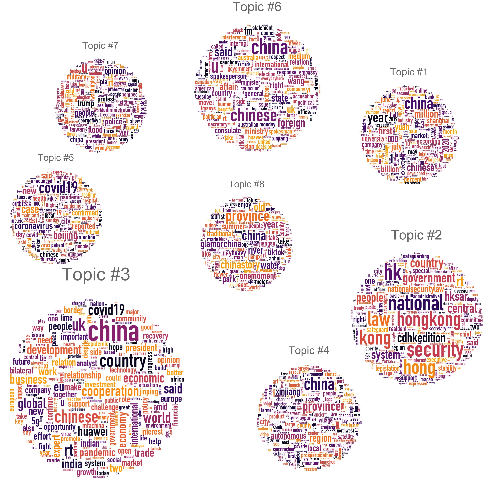
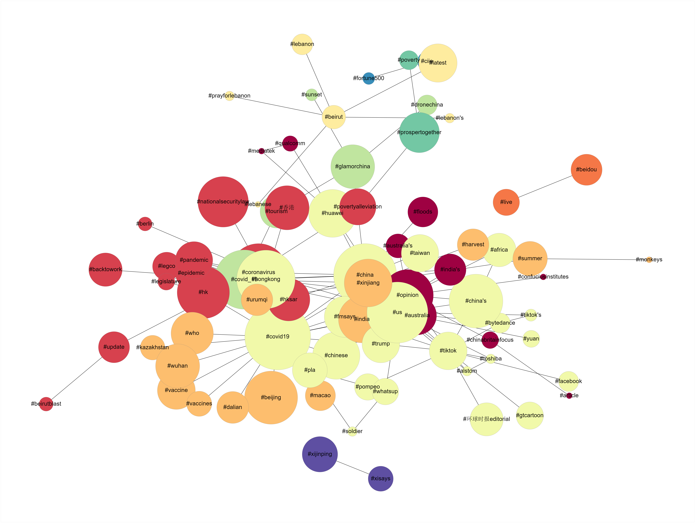

# Chinese Twitter
_by *_

## Project Developers
Anita Kurm and Maris Sala 

## Project Description
Exploration of tweets by [Chinese officials](https://docs.google.com/document/d/1q4XxcWuYIAu-DRc45zEbbE_Ybq5-jxRz/edit#heading=h.gjdgxs) for a research application. Main goal was to develop informative visualisations described below.

### Data description
The English corpus consists of 21.387 tweets by Chinese officials in English language posted in the period from 2020-05-19 to 2020-08-05. All tweets in the corpus have been lower-cased, stripped of punctuation, stop words and URL links and tokenised prior to visualisation.

### Frequent Terms Plot

Plot 1. Frequency distribution of Top 50 most used terms among uni- and bi-grams in the English corpus. 

***Technical reference**: Top 50 was defined using CountVectorizer by sklearn and distribution was visualized using FreqDistVisualizer by yellowbrick.*

### Topic Model Visualisation in Word Clouds

Plot 2. Visualisation of LDA topic model (number of topics = 8) fitted to the English corpus. Word clouds were generated with top 200 terms in every topic. Relative size and location of topics reflect prevalence in the corpus and distance between them, as defined in the interactive pyLDAvis visualisation of the model.

***Technical reference**: Data was additionally lemmatised prior to topic modelling. Topic modelling was conducted using Latent Dirichlet Allocation (LDA) model by gensim. Word clouds were generated from the fitted LDA model using WordCloud module in Python. Word Clouds were assembled manually in an online photo editor BeFunky based on the interactive visualisation generated using pyLDAvis.*

### Hashtag Network Plots
**May hashtags**

**June hashtags**

**July hashtags**

**August hashtags**

To make these visualizations, the English dataset was used. Hashtags were extracted from the tweets to create co-hashtags: hashtags that coexist in tweets. The amount of times a hashtag pair repeats across tweets was calculated as count and for the sake of maintaining meaningfulness in the plots, the pairs that only exist in one tweet were removed from analysis.

Overall there were ~21 300 tweets, out of which 9302 tweets had co-hashtags. In total that gave ~24 000 hashtags for the whole dataset. The data was split based on the months May, June, July, and August. The dataset starts on 20th of May, 2020 and ends with 5th of August, 2020 which means that the plots for May and August do not include hashtags for the entire month's duration.

For the visualizations, the nodes represent hashtags and the edges show the connectivity between hashtags. Node sizes are log transformed counts of how frequently the individual hashtags appear within the whole dataset.

Louvain community detection was applied to extract partitions of hashtags which co-occur more densely together with each other compared to other hashtags in the same plot - the node color visualizes the different groups that form in this way.

## Data Assessment ##
| Source | risk | Storage | Comment|
| --- |:---:|---|---|
|Twitter|low|Grundtvig| Multilingual|

## Time Estimate ##
Done by 14th of August 2020

## Deadline ##
ASAP in August 2020

## License ##
This software is [MIT licensed](./LICENSE.txt).
